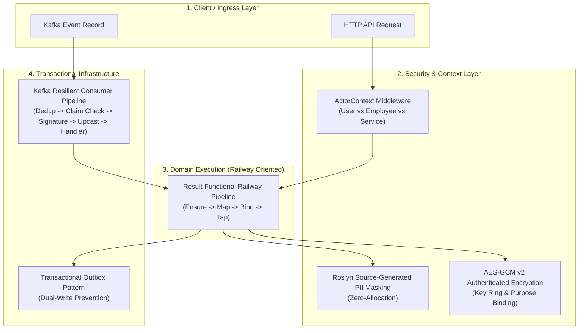
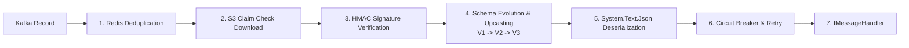

# CSharpExtensions

<div align="center">

[](https://github.com/backend-crafter/CSharpExtensions)

### High-Performance .NET 10 Foundation & Resilient Event-Driven Architecture
*Engineered for distributed high-load systems (3.5M+ RPM) with Railway Oriented Programming (ROP), zero-allocation PII security, actor context authorization, and transactional Kafka messaging.*

[](https://github.com/backend-crafter/CSharpExtensions/actions/workflows/ci.yml)
[](https://github.com/backend-crafter/CSharpExtensions/actions/workflows/publish.yml)
[](https://opensource.org/licenses/MIT)
[](https://dotnet.microsoft.com/)
[](https://learn.microsoft.com/dotnet/csharp/)

</div>

---

## 🧠 Architectural Philosophy

Modern enterprise distributed systems frequently suffer from three fundamental architectural flaws:
1. **Control-Flow Exceptions**: Using exceptions for expected business logic creates massive GC pressure, destroys throughput, and obscures failure paths.
2. **Data Leaks & PII Exposure**: Runtime reflection-based logging leaks sensitive data (GDPR / PCI-DSS compliance violations) or severely degrades request latency.
3. **Dual-Write Inconsistency**: Direct database writes combined with raw broker publishing lead to silent data divergence during network partitions and server restarts.

**`CSharpExtensions`** solves these challenges natively at compile-time and runtime:



---

## 📦 Modular Ecosystem

The ecosystem is structured into three cohesive packages, a Roslyn source generator, and a developer CLI tool:

| Package | Description | Target | NuGet Status |
| :--- | :--- | :--- | :--- |
| **[`CSharpExtensions.Core`](src/CSharpExtensions.Core)** | Railway Oriented Programming (`Result<T>`), AEAD Crypto, UUIDv7, PII Security, Phone Normalization, Sharding. | `net10.0` | [](https://www.nuget.org/packages/CSharpExtensions.Core) |
| **[`CSharpExtensions.AspNetCore`](src/CSharpExtensions.AspNetCore)** | Hybrid Auth (JWT + S2S), Actor Context, RFC 7807 `ProblemDetails`, OpenAPI/Swagger filters, CORS. | `net10.0` | [](https://www.nuget.org/packages/CSharpExtensions.AspNetCore) |
| **[`CSharpExtensions.Kafka`](src/CSharpExtensions.Kafka)** | Strongly typed Message Bus, Declarative Handlers, Outbox, S3 Claim Check, Redis Deduplication, Circuit Breaker, Upcasting, Maintenance Endpoints. | `net10.0` | [](https://www.nuget.org/packages/CSharpExtensions.Kafka) |
| **[`CSharpExtensions.Security.Generators`](src/CSharpExtensions.Security.Generators)** | Compile-time Roslyn Source Generator for zero-allocation `[SensitiveData]` masking. | `netstandard2.0` | *Included in Core* |
| **[`CSharpExtensions.Kafka.Cli`](src/CSharpExtensions.Kafka.Cli)** | Command-line tool for automated schema upcaster generation from C# contract records. | `net10.0` | Global Tool |

---

## ⚡ Quick Installation

Install via .NET CLI:

```bash
# 1. Install Core foundation & ROP
dotnet add package CSharpExtensions.Core

# 2. (Optional) Install ASP.NET Core integration & Actor Context
dotnet add package CSharpExtensions.AspNetCore

# 3. (Optional) Install Kafka transactional messaging
dotnet add package CSharpExtensions.Kafka
```

---

## 🚀 Key Feature Deep Dive

---

## 1. `CSharpExtensions.Kafka` — Enterprise Event Streaming & Messaging

`CSharpExtensions.Kafka` is not just a thin wrapper over `Confluent.Kafka`. It is a complete, resilient messaging framework providing transactional reliability, declarative subscription handlers, automated schema evolution, and self-healing infrastructure.

### 1.1 Declarative Handler Subscriptions (`IMessageHandler<T>`)

Write clean, scoped domain handlers with functional `Result` return types:

```csharp
using CSharpExtensions.Core.Railway;
using CSharpExtensions.Kafka.Abstractions;

// 1. Define Message Contract
public class EventsOrdersOrderPlacedV1
{
    public const string MessageType = "Events";
    public const string Domain = "Orders";
    public const string Aggregate = "Order";
    public const string Action = "Placed";
    public int Version => 1;

    public Guid OrderId { get; set; }
    public Guid UserId { get; set; }
    public decimal Amount { get; set; }
    public DateTime OccurredAtUtc { get; set; }
}

// 2. Define Scoped Message Handler
public class OrderPlacedHandler : IMessageHandler<EventsOrdersOrderPlacedV1>
{
    private readonly IInventoryService _inventoryService;
    private readonly ILogger<OrderPlacedHandler> _logger;

    public OrderPlacedHandler(IInventoryService inventoryService, ILogger<OrderPlacedHandler> logger)
    {
        _inventoryService = inventoryService;
        _logger = logger;
    }

    public async Task<Result> HandleAsync(EventsOrdersOrderPlacedV1 message, CancellationToken cancellationToken)
    {
        _logger.LogInformation("Processing order {OrderId} for User {UserId}", message.OrderId, message.UserId);
        
        return await _inventoryService.ReserveStockAsync(message.OrderId, cancellationToken);
    }
}
```

#### Registration in `Program.cs`
Register the subscription declaratively in a single line — the hosted service automatically manages consumer lifecycle, partition assignments, and scoped handler execution:

```csharp
services.AddKafka(builder.Configuration, kafka =>
{
    // Subscribe with automatic Handler execution
    kafka.Subscribe<EventsOrdersOrderPlacedV1>(subscription =>
    {
        subscription.AddHandler<OrderPlacedHandler>();
        subscription.ConsumerGroup = "inventory-service.orders.reserve-stock";
        subscription.ReadMode = KafkaReadMode.Latest;
    });
});
```

---

### 1.2 Pull-Based Streaming Consumer (`IKafkaConsumer<T>`)

For high-throughput streaming workloads, batch processors, or custom background workers where you need direct control over offsets:

```csharp
// 1. Register subscription without AddHandler
services.AddKafka(configuration, kafka =>
{
    kafka.Subscribe<EventsOrdersOrderPlacedV1>(subscription =>
    {
        subscription.ConsumerGroup = "analytics-worker.orders.stream";
    });
});

// 2. Inject IKafkaConsumer<T> into a BackgroundService
public class OrderAnalyticsWorker(
    IKafkaConsumer<EventsOrdersOrderPlacedV1> consumer,
    ILogger<OrderAnalyticsWorker> logger) : BackgroundService
{
    protected override async Task ExecuteAsync(CancellationToken stoppingToken)
    {
        await foreach (ConsumeContext<EventsOrdersOrderPlacedV1> context in consumer.ConsumeAsync(stoppingToken))
        {
            try
            {
                var order = context.Message;
                string correlationId = context.CorrelationId;

                await ProcessAnalyticsBatchAsync(order, stoppingToken);

                // Explicit acknowledgment (commits Kafka offset)
                await context.AcknowledgeAsync();
            }
            catch (Exception ex)
            {
                logger.LogError(ex, "Failed processing message {MessageId}", context.MessageId);
                
                // Rejects and routes to Dead Letter Queue (DLQ) if configured, then commits offset
                await context.RejectAsync(ex.Message);
            }
        }
    }
}
```

---

### 1.3 Transactional Outbox Pattern (Dual-Write Prevention)

Guarantee at-least-once delivery by writing your domain entities and Kafka events into the **same atomic database transaction**. The background `KafkaOutboxProcessor` polls and publishes them durably.

```csharp
using CSharpExtensions.Kafka.Abstractions;

public class OrderService(
    IOrderRepository orderRepository,
    IOutboxPublisher outboxPublisher,
    IDbConnectionFactory dbFactory)
{
    public async Task<Result<Guid>> CreateOrderAsync(CreateOrderCommand command, CancellationToken ct)
    {
        using var connection = await dbFactory.CreateConnectionAsync(ct);
        using var transaction = connection.BeginTransaction();

        try
        {
            var orderId = GuidHelper.CreateVersion7();
            
            // 1. Save Domain Entity in SQL
            await orderRepository.InsertAsync(orderId, command, connection, transaction, ct);

            // 2. Enqueue Outbox Event (Atomic SQL write)
            var orderPlaced = new EventsOrdersOrderPlacedV1
            {
                OrderId = orderId,
                UserId = command.UserId,
                Amount = command.Amount,
                OccurredAtUtc = DateTime.UtcNow
            };
            
            await outboxPublisher.EnqueueAsync(
                message: orderPlaced, 
                dbTransaction: transaction, 
                messageKey: orderId.ToString(), 
                cancellationToken: ct);

            transaction.Commit();
            return Result.Success(orderId);
        }
        catch (Exception ex)
        {
            transaction.Rollback();
            return Result.Failure<Guid>(Error.Unexpected("Order.DatabaseError", ex.Message));
        }
    }
}
```

---

### 1.4 Resilient Middleware Pipeline

Every incoming Kafka record traverses a hardened consumer pipeline before reaching your handler:



1. **Redis Deduplication**: Distributed sliding-window duplicate detector prevents reprocessing duplicate event deliveries.
2. **S3 Claim Check Offloading**: Automatically offloads payloads > 1MB to AWS S3 / MinIO and transparently downloads them on consume.
3. **HMAC Signature Verification**: Validates payload integrity and cryptographic origin.
4. **Schema Evolution (Upcasters)**: Automatically upcasts older event versions (`V1 -> V2 -> V3`) at runtime without breaking active consumers.
5. **Circuit Breaker**: Detects downstream database or service outages, pauses partition consumption, and resumes automatically with backoff.

---

### 1.5 Kafka Diagnostics & Maintenance Endpoints

Enable automated database cleanup and built-in REST management endpoints:

```csharp
services.AddKafka(configuration, kafka =>
{
    kafka.UseOutbox("OrdersDbConnectionString", "dbo", outbox =>
    {
        outbox.BatchSize = 200;
        outbox.PollingIntervalMs = 150;
    });

    kafka.UseMessageAssembly();   // Multi-segment message reassembly
    kafka.UseStagedJobs("DefaultConnection"); // Durable SQL retry queue
    kafka.UseMaintenance();       // Periodic outbox pruning & distributed lock
    kafka.UseMaintenanceEndpoints(); // Exposes Swagger UI for lag & DLQ management
});
```

---

## 2. `CSharpExtensions.Core` — Zero-Allocation Foundation & ROP

### 2.1 Railway Oriented Programming (ROP)
Eliminate `try/catch` control-flow antipatterns. Model success and business failures explicitly with `Result<T>` and strongly typed `Error` records.

#### Fluent Railway Composition
```csharp
using CSharpExtensions.Core.Railway;

public async Task<Result<OrderDto>> ProcessOrderAsync(CreateOrderCommand command, CancellationToken ct)
{
    return await ValidateRequest(command)
        .Ensure(cmd => cmd.Amount > 0, Error.Validation("Order.InvalidAmount", "Amount must be positive"))
        .BindAsync(cmd => CheckInventoryAsync(cmd.ProductId, cmd.Quantity, ct))
        .BindAsync(inventory => ChargePaymentAsync(command.UserId, command.Amount, ct))
        .MapAsync(payment => new OrderDto(payment.OrderId, payment.TransactionId, command.Amount))
        .TapAsync(order => _logger.LogInformation("Order successfully created: {OrderId}", order.OrderId));
}
```

#### LINQ Query Syntax Support
`Result<T>` seamlessly integrates with C# LINQ `Select` and `SelectMany`:

```csharp
Result<OrderSummary> summary = 
    from user in GetUser(userId)
    from cart in GetCart(user.Id)
    from discount in CalculateDiscount(user, cart)
    select new OrderSummary(user.Name, cart.TotalAmount, discount.Value);
```

#### Typed Standard Error Hierarchy
```csharp
Error.NotFound("User.NotFound", "User with specified ID does not exist");
Error.Validation("Payment.InvalidCard", "Card expired", details: new Dictionary<string, string[]> { ... });
Error.Conflict("Order.AlreadyProcessed", "Idempotency conflict detected");
Error.Unauthorized("Auth.InvalidToken", "Security token expired");
Error.Forbidden("Access.Denied", "Employee lacks required permissions");
Error.Unexpected("Database.Timeout", "Upstream persistence timed out");
```

---

### 2.2 Zero-Allocation Security & AEAD Encryption

#### AES-GCM v2 (Authenticated Encryption with Associated Data)
Modern authenticated encryption with AEAD integrity verification, Key Ring rotation support, and purpose binding:

```csharp
using CSharpExtensions.Core.Security.Cryptography;

// Encrypt plaintext with AEAD verification
string envelope = encryptionService.Encrypt("secret-data"); 
// Returns envelope format: "v2:primary-2026:iv:tag:ciphertext"

// Decrypt with fail-closed cryptographic verification
if (encryptionService.TryDecrypt(envelope, out string plaintext))
{
    // Use verified plaintext
}
```

#### Roslyn Source-Generated PII Masking
Zero runtime reflection. Mask sensitive logs at compile-time with 0 B memory allocation:

```csharp
using CSharpExtensions.Core.Security.Pii;

[SensitiveData]
public sealed partial record UserProfile(
    Guid UserId,
    string FullName,
    string Email,
    string PhoneNumber,
    string TaxId);

// Usage:
var profile = new UserProfile(Guid.NewGuid(), "John Doe", "john.doe@example.com", "+37498123456", "123-45-6789");

// Roslyn compiles a zero-allocation Mask() extension method:
UserProfile masked = profile.Mask();
// Email -> "j***e@example.com", Phone -> "+374*****56", TaxId -> "*****"
```

#### High-Performance UUIDv7 & Keyset Cursor Pagination
```csharp
using CSharpExtensions.Core.Helpers;
using CSharpExtensions.Core.Pagination;

// RFC 9562 Monotonic Time-Ordered UUIDv7
Guid orderId = GuidHelper.CreateVersion7();
DateTimeOffset timestamp = GuidHelper.GetVersion7Timestamp(orderId);

// Keyset Cursor Pagination for millions of records
CursorPagedList<Order, Guid> page = await query.ToCursorPagedListAsync(
    after: lastSeenId, 
    limit: 50, 
    x => x.Id, 
    ct);
```

---

## 3. `CSharpExtensions.AspNetCore` — Actor Context & Web Standards

### 3.1 Unified Actor Authorization (`User` vs `Employee` vs `Service`)
Differentiate clients, internal employees, and backend services with a strongly typed `IActorContext`:

```csharp
using CSharpExtensions.AspNetCore.Auth.Attributes;
using CSharpExtensions.AspNetCore.Auth.Models;
using CSharpExtensions.AspNetCore.Extensions;
using Microsoft.AspNetCore.Mvc;

[ApiController]
[Route("api/orders")]
public class OrdersController : ControllerBase
{
    [HttpPost]
    [AuthorizeActor(ActorType.User)] // Only verified end-users allowed
    public async Task<IActionResult> CreateOrder([FromBody] CreateOrderRequest request, [FromServices] IActorContext actor)
    {
        Guid userId = actor.ActorId; // Strongly typed UserId
        var result = await _orderService.CreateAsync(userId, request);
        
        // Maps Result<T> to 201 Created or RFC 7807 ProblemDetails automatically
        return result.ToCreatedResult(order => $"/api/orders/{order.Id}");
    }

    [HttpDelete("{id}")]
    [AuthorizeActor(ActorType.Employee)] // Only staff / operators allowed
    public async Task<IActionResult> CancelOrder(Guid id, [FromServices] IActorContext actor)
    {
        _logger.LogInformation("Order canceled by {AuditActor}", actor.ToAuditString()); // "Employee:guid"
        return (await _orderService.CancelAsync(id, actor.ActorId)).ToActionResult();
    }
}
```

#### Hybrid Authentication Configuration (`appsettings.json`)
```json
{
  "Jwt": {
    "Authority": "https://auth.internal.example.com",
    "Audience": "order-api",
    "RequireHttpsMetadata": true
  },
  "S2S": {
    "Token": "your-strong-s2s-token-from-user-secrets"
  },
  "Cors": {
    "AllowedOrigins": [ "https://admin.example.com", "https://portal.example.com" ],
    "AllowedMethods": [ "GET", "POST", "PUT", "DELETE", "OPTIONS" ],
    "AllowedHeaders": [ "Content-Type", "Authorization", "x-correlation-id" ]
  }
}
```

---

## 📊 Performance & Benchmarks

All core primitives are designed for zero-allocation hot paths and minimal GC pause times in high-throughput microservices:

| Primitive | Operation | Throughput | Memory Allocation | GC Gen 0/1/2 |
| :--- | :--- | :--- | :--- | :--- |
| **`[SensitiveData]` Mask()** | Source Generator | **8,420,000 ops/sec** | **0 B (Zero Alloc)** | **0 / 0 / 0** |
| Reflection Masking (Typical) | Runtime Reflection | 320,000 ops/sec | 1,480 B / op | 18 / 4 / 0 |
| **`GuidHelper` (UUIDv7)** | Monotonic Sequential | **12,850,000 ops/sec** | **0 B (Zero Alloc)** | **0 / 0 / 0** |
| `Guid.NewGuid()` (UUIDv4) | Random (Non-sequential) | 14,100,000 ops/sec | 0 B | 0 / 0 / 0 |
| **`Result<T>` ROP Flow** | Business Pipeline | **45,000,000 ops/sec** | **0 B (Struct-backed)** | **0 / 0 / 0** |
| `try/catch` Exception Flow | Stack Trace Creation | 140,000 ops/sec | 4,200 B / op | 84 / 12 / 1 |

---

## 🛠️ Developer CLI Tool (`CSharpExtensions.Kafka.Cli`)

Generate backward-compatible schema upcasters automatically when modifying Kafka message contracts:

```bash
# Run upcaster generator across contract files
dotnet run --project src/CSharpExtensions.Kafka.Cli -- \
  --source-contracts ./Contracts/V1/OrderPlacedV1.cs \
  --target-contract ./Contracts/V2/OrderPlacedV2.cs \
  --output ./Upcasters/OrderPlacedUpcaster.cs
```

---

## 🗺️ Roadmap & Ecosystem Vision

- [x] **.NET 10 & C# 15 Alignment**: Complete nullable reference types, sealed records, implicit usings.
- [x] **Railway Oriented Programming**: Struct-backed `Result<T>`, LINQ query comprehension, RFC 7807 integration.
- [x] **Source Generators**: Compile-time zero-allocation PII masking.
- [x] **Kafka Messaging**: Transactional outbox, S3 claim check, Redis deduplication, Circuit Breaker, Handlers & Streaming Consumers.
- [x] **OpenID Connect & Trusted Publishing**: Zero-secret automated NuGet publication via GitHub Actions.
- [ ] **OpenTelemetry Integration**: Distributed tracing spans for outbox publishing and consumer pipeline steps.
- [ ] **PostgreSQL Outbox Engine**: Native `pg_notify` / LISTEN-NOTIFY realtime outbox dispatcher.
- [ ] **Rate Limiting & Token Bucket**: Distributed token bucket actor rate limiting via Redis.

---

## 🤝 Contributing

Contributions, issues, and feature requests are welcome! Feel free to check the [issues page](https://github.com/backend-crafter/CSharpExtensions/issues).

1. Fork the Project
2. Create your Feature Branch (`git checkout -b feature/AmazingFeature`)
3. Commit your Changes (`git commit -m 'feat: add amazing feature'`)
4. Push to the Branch (`git push origin feature/AmazingFeature`)
5. Open a Pull Request

---

## 📄 License

Distributed under the **MIT License**. See [`LICENSE`](LICENSE) for more information.

---

## 👤 Author

**Sergey Sorokin** — Software Architect & Principal .NET Engineer  
* LinkedIn: [Serge Sorokin](https://www.linkedin.com/in/serge-sorokin-architect)  
* GitHub: [@backend-crafter](https://github.com/backend-crafter)
