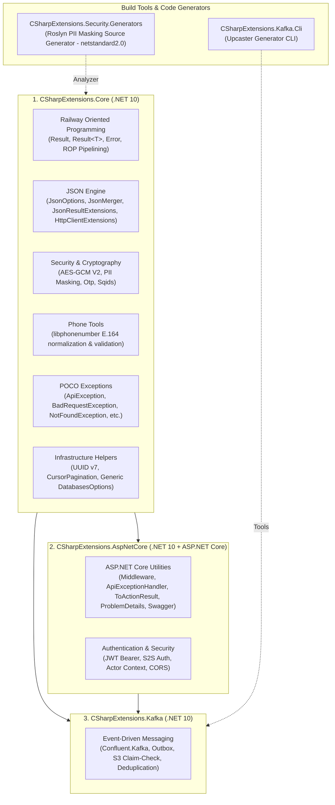

# CSharpExtensions Ecosystem — .NET 10 Enterprise Infrastructure

The official enterprise shared foundation for modern .NET 10 microservices. The suite prioritizes explicit failure semantics via **Railway Oriented Programming (ROP)**, zero-trust security boundaries, allocation-aware hot paths, and streamlined developer experience.

---

## 📦 NuGet Packages Architecture

The ecosystem is consolidated into **3 core packages** (plus build-time analyzers and CLI tools):



| Package | Target | Description | Typical Usage |
| :--- | :--- | :--- | :--- |
| **`CSharpExtensions.Core`** | `net10.0` | Pure .NET 10 foundation: ROP, JSON, Security/PII, Phone, POCO Exceptions, UUID v7. | Domain, Application, Background Workers, Lambdas, Web APIs |
| **`CSharpExtensions.AspNetCore`** | `net10.0` | ASP.NET Core web host: Auth (JWT Bearer + S2S), Swagger, RFC 9457 ProblemDetails, `ToActionResult()`, Middleware. | Web APIs, BFFs, Gateways |
| **`CSharpExtensions.Kafka`** | `net10.0` | Event-Driven message bus: Confluent.Kafka, Outbox, S3 Claim Check, Redis Deduplication. | Event-Driven services, Consumers, Producers |

---

## 🚀 Quick Start

### 1. Web API Service (`Program.cs`)
```csharp
using CSharpExtensions.AspNetCore.Extensions;
using CSharpExtensions.Core.Railway;

var builder = WebApplication.CreateBuilder(args);

// 1. Core & Web API Infrastructure
builder.Services.AddControllers();
builder.Services.AddEndpointsApiExplorer();
builder.Services.AddSwaggerDocumentation(typeof(Program).Assembly);

// 2. Railway ROP & Global Exception Handling (RFC 9457)
builder.Services.AddRailwayWithApiExceptions();

// 3. Hybrid Authentication (Standard JWT Bearer + S2S) & CORS
builder.Services.AddHybridAuthentication(builder.Configuration);
builder.Services.AddCorsPolicy(builder.Configuration);

var app = builder.Build();

// 4. Middleware Pipeline
app.UseCorrelationId();
app.UseRailwayWithApiExceptions();
app.UseCors("DefaultPolicy");
app.UseAuthentication();
app.UseAuthorization();
app.UseSwaggerDocumentation(typeof(Program).Assembly);

app.MapControllers();
app.Run();
```

---

## 1. `CSharpExtensions.Core`

The foundational library containing zero heavy native dependencies or web host requirements.

### 1.1 Railway Oriented Programming (ROP)

Eliminates runtime exceptions for predictable business logic. Methods return `Result` or `Result<T>`, forcing explicit handling of the success/failure tracks.

```csharp
using CSharpExtensions.Core.Railway;
using CSharpExtensions.Core.Railway.Extensions;

public async Task<Result<OrderDto>> ProcessOrderAsync(CreateOrderRequest request, CancellationToken ct)
{
    return await Result.Success(request)
        // 1. Guard check
        .Ensure(req => req.Amount > 0, new Error("Amount must be positive").AsBadRequest("InvalidAmount", "Validation Error"))
        // 2. Async business operation
        .ThenAsync(req => _paymentService.AuthorizeFundsAsync(req.UserId, req.Amount, ct))
        // 3. Persist order
        .ThenAsync(auth => _orderRepository.SaveOrderAsync(auth, ct))
        // 4. Inline diagnostics without mutating result
        .LogIfSuccess("Order created successfully for User {UserId}", request.UserId)
        .LogIfFailure("Order creation failed for User {UserId}", request.UserId)
        // 5. Transform to output DTO
        .Transform(order => new OrderDto(order.Id, order.Status));
}
```

#### Monadic Retries (`TryResultAgainAsync`)
Standardized exponential backoff with cancellation token support for ROP pipelines:
```csharp
var result = await chargeAction.TryResultAgainAsync(
    maxAttempts: 3,
    initialDelay: TimeSpan.FromSeconds(1),
    shouldRetry: error => error.HttpStatusCode == 429 || error.Type == "TransientFailure",
    backoffMultiplier: 2.0,
    cancellationToken: ct);
```

---

### 1.2 High-Performance JSON & HTTP

Pre-configured `System.Text.Json` profiles and zero-allocation scanning utilities.

*   `JsonOptions.Default`: Standard camelCase profile for internal service contracts.
*   `JsonOptions.ExternalStrict`: Untrusted payload profile (rejects comments, trailing commas, unknown members, and duplicate properties).
*   `JsonOptions.SnakeCase` / `KebabCase`: For external webhook integrations.

#### Safe Deserialization & Streaming HTTP Client
```csharp
using CSharpExtensions.Core.Json;
using CSharpExtensions.Core.Json.Extensions;

// 1. Pre-scanned structural validation (prevents malformed JSON attacks)
if (payloadBytes.AsSpan().TryDeserializeSafe<UserPayload>(out var user, JsonOptions.ExternalStrict))
{
    // High-safety zone: 'user' is guaranteed valid and non-null
}

// 2. Result-aware streaming HTTP client
Result<UserProfile> profileResult = await httpClient.GetAsResultAsync<UserProfile>("https://api.internal/profile", ct);
```

#### `JsonMerger` (Document Merge Engine)
Deep-merges two JSON documents with configurable array handling (`Replace`, `Concat`, `Union`, `Merge`):
```csharp
byte[] mergedConfig = JsonMerger.Merge(baseJsonBytes, overrideJsonBytes, JsonMergeHandling.Replace);
```

---

### 1.3 Security & Cryptography

Enterprise-grade cryptography with legacy compatibility, OTP generation, Sqids, and compile-time PII masking.

*   **AES-GCM V2 (AEAD)**: Authenticated encryption with backward-compatible legacy AES-CBC decryption migration.
*   **Compile-Time PII Masking**: Source-generated masking for emails, phone numbers, and sensitive strings with zero runtime overhead.
*   **Secure OTP Generator**: Cryptographically secure numeric token generation.
*   **Sqids**: Bounded YouTube-style unique string ID generator.

```csharp
using CSharpExtensions.Core.Security.Pii;

// PII Masking
string maskedEmail = "user.contact@example.com".MaskEmail(); // "u***t@example.com"
string maskedPhone = "+37498123456".MaskPhone();              // "+374*****56"
string redacted = "sensitive_password_123".RedactText();     // "*****"
```

---

### 1.4 Phone Validation & Normalization (`libphonenumber`)

Standardized international phone number formatting based on Google's `libphonenumber`.

```csharp
using CSharpExtensions.Core.Phone;

bool isValid = "+37498123456".IsValidPhone(); // true
string? e164 = "098 12 34 56".NormalizePhone(); // "+37498123456"
```

---

### 1.5 RFC 9562 UUID v7 & Infrastructure Helpers

*   **`GuidHelper`**: Generates time-ordered UUIDv7 identifiers with millisecond precision and monotonic counter sequence.
    ```csharp
    Guid orderId = GuidHelper.CreateVersion7();
    DateTimeOffset createdAt = GuidHelper.GetVersion7Timestamp(orderId);
    ```
*   **Pagination**: `PagedList<T>` (offset-based) and `CursorPagedList<T, TCursor>` (keyset cursor-based for high-throughput streaming).
*   **Generic `DatabasesOptions`**: Universal configuration map for named databases bound from `appsettings.json` `"Databases"` section, validating connection strings, shard maps, and power-of-two sharding topologies on startup.

---

## 2. `CSharpExtensions.AspNetCore`

Integrates ASP.NET Core with the ecosystem standards.

### 2.1 Hybrid Authentication (JWT Bearer + S2S Auth)

Supports both standard OIDC / JWT Bearer authentication (Keycloak, Auth0, IdentityServer, Entra ID, etc.) and inter-service static token authentication via S2S headers.

#### Configuration (`appsettings.json`)
```json
{
  "Jwt": {
    "Authority": "https://auth.internal.example.com",
    "Audience": "your-api-audience",
    "RequireHttpsMetadata": true
  },
  "S2S": {
    "Token": "your-strong-s2s-token-from-secrets"
  },
  "Cors": {
    "AllowedOrigins": [ "https://admin.example.com" ],
    "AllowedMethods": [ "GET", "POST", "PUT", "DELETE", "OPTIONS" ],
    "AllowedHeaders": [ "Content-Type", "Authorization", "x-correlation-id" ]
  }
}
```

> [!IMPORTANT]
> **No Hardcoded Tokens:** In local development, inject the S2S token via `dotnet user-secrets`:
> ```powershell
> dotnet user-secrets set "S2S:Token" "your-secret-token"
> ```

#### Outgoing S2S HTTP Client Registration
```csharp
builder.Services.AddHttpClient<IWalletClient, WalletClient>(client =>
{
    client.BaseAddress = new Uri("https://wallet.internal");
}).AddS2SAuth(); // Automatically attaches X-S2S-Token header and disables redirects
```

---

### 2.2 Actor Context Engine

Strictly separates caller types and prevents security ambiguities:

```csharp
using CSharpExtensions.AspNetCore.Auth.Extensions;
using CSharpExtensions.AspNetCore.Auth.Models;

[ApiController]
[Route("api/v1/orders")]
public class OrdersController : ControllerBase
{
    [HttpPost]
    public async Task<ActionResult> CreateOrder([FromBody] OrderRequest request)
    {
        // Resolve polymorphic actor context (User [Client], Employee [Staff], Service [M2M], Anonymous)
        ActorContext actor = HttpContext.ResolveActorContext();
        
        if (actor.IsEmployee)
        {
            // Internal employee / backoffice operator action
            Guid employeeId = actor.ActorId!.Value;
        }
        else if (actor.IsUser)
        {
            // End-user client action
            Guid userId = actor.ActorId!.Value;
        }
        
        return Ok();
    }
}
```

---

### 2.3 ROP Controller Integration (`ToActionResult`)

Directly converts Railway `Result` and `Result<T>` to standard ASP.NET `ActionResult` and RFC 9457 `ProblemDetails`:

```csharp
[HttpGet("{id:guid}")]
public async Task<ActionResult<OrderDto>> GetOrder(Guid id, CancellationToken ct)
{
    return await _orderService.GetByIdAsync(id, ct)
        .ToActionResult(); // Maps 200 OK, 400 BadRequest, 404 NotFound, etc.
}
```

---

### 2.4 Swagger & OpenAPI with Git Metadata

Automatically groups endpoints, adds Bearer Auth documentation, and integrates build provenance metadata:

```csharp
builder.Services.AddSwaggerDocumentation(typeof(Program).Assembly);
app.UseSwaggerDocumentation(typeof(Program).Assembly);
```

---

## 3. `CSharpExtensions.Kafka`

Enterprise Event-Driven infrastructure powered by `Confluent.Kafka`.

### Key Capabilities
1. **Strongly-Typed Bus (`IKafkaBus`)**: High-performance publishing and consuming with automatic serialization.
2. **Transactional Outbox**: Guaranteed at-least-once message delivery via SQL Server transaction logs.
3. **Idempotency & Deduplication**: Redis and SQL-backed message deduplication preventing duplicate event processing.
4. **S3 Claim Check Pattern**: Large payload offloading to AWS S3 for payloads exceeding broker size limits.
5. **Schema Upcasters & CLI**: Versioned schema evolution with compile-time code generation via `CSharpExtensions.Kafka.Cli`.

---

## 🛠️ Development & Building

### Prerequisites
*   **.NET 10 SDK** (with C# 15 preview enabled)

### Build & Test Commands

```powershell
# 1. Restore & Build (Zero Warnings / Zero Errors)
dotnet build E:\GitHub\CSharpExtensions\CSharpExtensions.slnx -c Release

# 2. Run All 534+ Unit & Integration Tests
dotnet test E:\GitHub\CSharpExtensions\CSharpExtensions.slnx -c Release --no-build

# 3. Pack NuGet Artifacts
dotnet pack E:\GitHub\CSharpExtensions\CSharpExtensions.slnx -c Release
```

Generated packages are stored in `artifacts/`:
*   `CSharpExtensions.Core.1.0.0.nupkg`
*   `CSharpExtensions.AspNetCore.1.0.0.nupkg`
*   `CSharpExtensions.Kafka.1.0.0.nupkg`

---

## 📄 License & Standards
Developed for high-performance, fault-tolerant .NET 10 architectures following Clean Architecture and Domain-Driven Design principles.
