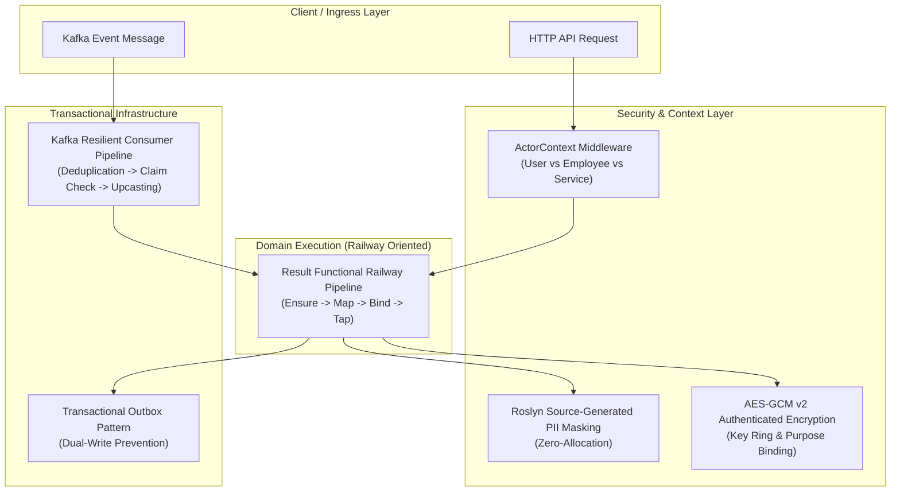
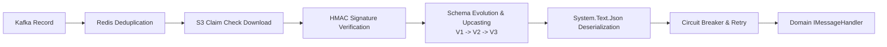

# CSharpExtensions


> **Enterprise-grade, zero-allocation foundation & event-driven microservices framework for .NET 10 & C# 15.**
> Built from real-world high-throughput production architecture (3.5M+ RPM) with native Railway Oriented Programming (ROP), compile-time Roslyn PII security, actor authorization, transactional Kafka outbox, and resilient event streaming.

[](https://github.com/backend-crafter/CSharpExtensions/actions/workflows/ci.yml)
[](https://github.com/backend-crafter/CSharpExtensions/actions/workflows/publish.yml)
[](https://opensource.org/licenses/MIT)
[](https://dotnet.microsoft.com/)
[](https://learn.microsoft.com/dotnet/csharp/)

---

## 🧠 Architectural Philosophy

Modern enterprise distributed systems frequently suffer from three fundamental architectural flaws:
1. **Control-Flow Exceptions**: Using exceptions for business logic creates massive GC pressure, destroys throughput, and obscures application failure paths.
2. **Data Leaks & PII Exposure**: Runtime reflection-based logging and masking leak sensitive data (GDPR/PCI-DSS violations) or severely degrade request latency.
3. **Dual-Write Inconsistency**: Direct writes to database + direct publishing to message brokers lead to silent data divergence during network partitions and server crashes.

**`CSharpExtensions`** solves these challenges natively at compile-time and runtime:



---

## 📦 Modular Ecosystem

The ecosystem is structured into three cohesive packages, a Roslyn source generator, and a developer CLI tool:

| Package | Purpose | Target | NuGet Status |
| :--- | :--- | :--- | :--- |
| **[`CSharpExtensions.Core`](src/CSharpExtensions.Core)** | Railway Oriented Programming (`Result<T>`), AEAD Crypto, UUIDv7, PII Security, Phone Normalization, Sharding. | `net10.0` | [](https://www.nuget.org/packages/CSharpExtensions.Core) |
| **[`CSharpExtensions.AspNetCore`](src/CSharpExtensions.AspNetCore)** | Hybrid Auth (JWT + S2S), Actor Context, RFC 7807 `ProblemDetails`, OpenAPI/Swagger filters, CORS. | `net10.0` | [](https://www.nuget.org/packages/CSharpExtensions.AspNetCore) |
| **[`CSharpExtensions.Kafka`](src/CSharpExtensions.Kafka)** | Transactional Outbox, S3 Claim Check, Redis Deduplication, Circuit Breaker, Schema Upcasting, Diagnostic Hosted Services. | `net10.0` | [](https://www.nuget.org/packages/CSharpExtensions.Kafka) |
| **[`CSharpExtensions.Security.Generators`](src/CSharpExtensions.Security.Generators)** | Compile-time Roslyn Source Generator for zero-allocation `[SensitiveData]` masking. | `netstandard2.0` | *Included in Core* |
| **[`CSharpExtensions.Kafka.Cli`](src/CSharpExtensions.Kafka.Cli)** | CLI tool for automated schema upcaster generation from C# contract records. | `net10.0` | Global Tool |

---

## ⚡ Quick Installation

Install via .NET CLI:

```bash
# 1. Install Core foundation & ROP
dotnet add package CSharpExtensions.Core

# 2. (Optional) Install ASP.NET Core integration & Actor Context
dotnet add package CSharpExtensions.AspNetCore

# 3. (Optional) Install Kafka transactional messaging
dotnet add package CSharpExtensions.Kafka
```

---

## 🚀 Key Feature Deep Dive

---

### 1. Railway Oriented Programming (ROP) — `CSharpExtensions.Core`

Eliminate `try/catch` control-flow antipatterns. Model success and business failures explicitly with `Result<T>` and strongly typed `Error` records.

#### Fluent Railway Composition
```csharp
using CSharpExtensions.Core.Railway;

public async Task<Result<OrderDto>> ProcessOrderAsync(CreateOrderCommand command, CancellationToken ct)
{
    return await ValidateRequest(command)
        .Ensure(cmd => cmd.Amount > 0, Error.Validation("Order.InvalidAmount", "Amount must be positive"))
        .BindAsync(cmd => CheckInventoryAsync(cmd.ProductId, cmd.Quantity, ct))
        .BindAsync(inventory => ChargePaymentAsync(command.UserId, command.Amount, ct))
        .MapAsync(payment => new OrderDto(payment.OrderId, payment.TransactionId, command.Amount))
        .TapAsync(order => _logger.LogInformation("Order successfully created: {OrderId}", order.OrderId));
}
```

#### LINQ Query Syntax Support
`Result<T>` seamlessly integrates with C# LINQ `Select` and `SelectMany`:

```csharp
Result<OrderSummary> summary = 
    from user in GetUser(userId)
    from cart in GetCart(user.Id)
    from discount in CalculateDiscount(user, cart)
    select new OrderSummary(user.Name, cart.TotalAmount, discount.Value);
```

#### Typed Standard Error Hierarchy
```csharp
Error.NotFound("User.NotFound", "User with specified ID does not exist");
Error.Validation("Payment.InvalidCard", "Card expired", details: new Dictionary<string, string[]> { ... });
Error.Conflict("Order.AlreadyProcessed", "Idempotency conflict detected");
Error.Unauthorized("Auth.InvalidToken", "Security token expired");
Error.Forbidden("Access.Denied", "Employee lacks required permissions");
Error.Unexpected("Database.Timeout", "Upstream persistence timed out");
```

---

### 2. Zero-Allocation Security & AEAD Encryption — `CSharpExtensions.Core`

#### AES-GCM v2 (Authenticated Encryption with Associated Data)
Modern authenticated encryption with AEAD integrity verification, Key Ring rotation support, and purpose binding:

```csharp
using CSharpExtensions.Core.Security.Cryptography;

// Configure via DI with active key rotation and purpose binding
services.AddSingleton<IEncryptionService, EncryptionService>();

// Encrypt plaintext with AEAD verification
string envelope = encryptionService.Encrypt("secret-data"); 
// Returns envelope format: "v2:primary-2026:iv:tag:ciphertext"

// Decrypt with fail-closed cryptographic verification
if (encryptionService.TryDecrypt(envelope, out string plaintext))
{
    // Use verified plaintext
}
```

#### Roslyn Source-Generated PII Masking
Zero runtime reflection. Mask sensitive logs at compile-time:

```csharp
using CSharpExtensions.Core.Security.Pii;

[SensitiveData]
public sealed partial record UserProfile(
    Guid UserId,
    string FullName,
    string Email,
    string PhoneNumber,
    string TaxId);

// Usage:
var profile = new UserProfile(Guid.NewGuid(), "John Doe", "john.doe@example.com", "+37498123456", "123-45-6789");

// Roslyn compiles a zero-allocation Mask() extension method:
UserProfile masked = profile.Mask();
// Email -> "j***e@example.com", Phone -> "+374*****56", TaxId -> "*****"
```

#### High-Performance UUIDv7 & Keyset Cursor Pagination
```csharp
using CSharpExtensions.Core.Helpers;
using CSharpExtensions.Core.Pagination;

// RFC 9562 Monotonic Time-Ordered UUIDv7
Guid orderId = GuidHelper.CreateVersion7();
DateTimeOffset timestamp = GuidHelper.GetVersion7Timestamp(orderId);

// Keyset Cursor Pagination for millions of records
CursorPagedList<Order, Guid> page = await query.ToCursorPagedListAsync(
    after: lastSeenId, 
    limit: 50, 
    x => x.Id, 
    ct);
```

---

### 3. ASP.NET Core & Actor Context — `CSharpExtensions.AspNetCore`

#### Unified Actor Authorization (`User` vs `Employee` vs `Service`)
Differentiate clients, internal employees, and backend services with a strongly typed `IActorContext`:

```csharp
using CSharpExtensions.AspNetCore.Auth.Attributes;
using CSharpExtensions.AspNetCore.Auth.Models;
using CSharpExtensions.AspNetCore.Extensions;
using Microsoft.AspNetCore.Mvc;

[ApiController]
[Route("api/orders")]
public class OrdersController : ControllerBase
{
    [HttpPost]
    [AuthorizeActor(ActorType.User)] // Only verified end-users allowed
    public async Task<IActionResult> CreateOrder([FromBody] CreateOrderRequest request, [FromServices] IActorContext actor)
    {
        Guid userId = actor.ActorId; // Strongly typed UserId
        var result = await _orderService.CreateAsync(userId, request);
        
        // Maps Result<T> to 201 Created or RFC 7807 ProblemDetails automatically
        return result.ToCreatedResult(order => $"/api/orders/{order.Id}");
    }

    [HttpDelete("{id}")]
    [AuthorizeActor(ActorType.Employee)] // Only staff / operators allowed
    public async Task<IActionResult> CancelOrder(Guid id, [FromServices] IActorContext actor)
    {
        _logger.LogInformation("Order canceled by {AuditActor}", actor.ToAuditString()); // "Employee:guid"
        return (await _orderService.CancelAsync(id, actor.ActorId)).ToActionResult();
    }
}
```

#### Hybrid Authentication Configuration (`appsettings.json`)
```json
{
  "Jwt": {
    "Authority": "https://auth.internal.example.com",
    "Audience": "order-api",
    "RequireHttpsMetadata": true
  },
  "S2S": {
    "Token": "your-strong-s2s-token-from-user-secrets"
  },
  "Cors": {
    "AllowedOrigins": [ "https://admin.example.com", "https://portal.example.com" ],
    "AllowedMethods": [ "GET", "POST", "PUT", "DELETE", "OPTIONS" ],
    "AllowedHeaders": [ "Content-Type", "Authorization", "x-correlation-id" ]
  }
}
```

---

### 4. Enterprise Kafka & Transactional Outbox — `CSharpExtensions.Kafka`

#### Transactional Outbox Dual-Write Prevention
Guarantees at-least-once message delivery by committing outbox records in the same atomic SQL transaction as business data:

```csharp
using CSharpExtensions.Kafka.Abstractions;

public async Task<Result<Unit>> PlaceOrderAsync(Order order, CancellationToken ct)
{
    using var connection = await _db.CreateConnectionAsync(ct);
    using var transaction = connection.BeginTransaction();

    try
    {
        // 1. Save Domain Entity
        await _orderRepository.InsertAsync(order, connection, transaction, ct);

        // 2. Enqueue Outbox Event (Atomic with the SQL transaction)
        var orderEvent = new EventsOrdersOrderPlacedV1
        {
            OrderId = order.Id,
            UserId = order.UserId,
            Amount = order.TotalAmount,
            OccurredAtUtc = DateTime.UtcNow
        };
        await _messageBus.PublishOutboxAsync(orderEvent, connection, transaction, ct);

        transaction.Commit();
        return Result.Success(Unit.Value);
    }
    catch (Exception ex)
    {
        transaction.Rollback();
        return Result.Failure<Unit>(Error.Unexpected("Order.DatabaseError", ex.Message));
    }
}
```

#### Advanced Consumer Pipeline
The Kafka consumer executes a modular, resilient pipeline before delivering events to your handlers:



#### Resilient Consumer Registration
```csharp
services.AddKafkaMessaging(options =>
{
    options.BootstrapServers = "kafka:9092";
    options.Deduplication.IsEnabled = true;
    options.Deduplication.RedisConnectionAlias = "default";
    options.ClaimCheck.IsEnabled = true;
    options.ClaimCheck.S3BucketName = "message-payloads";
    options.Outbox.IsEnabled = true;
    options.Outbox.ConnectionStringName = "Databases:Orders:ConnectionStrings";
})
.AddConsumer<EventsOrdersOrderPlacedV1, OrderPlacedHandler>(subscription =>
{
    subscription.ConsumerGroup = "orders-service.billing.process-order";
    subscription.ReadMode = KafkaReadMode.Latest;
    subscription.DeadLetterQueueEnabled = true;
});
```

---

## 📊 Performance & Benchmarks

All core primitives are built for zero-allocation and minimal GC pause times in high-throughput environments:

| Primitive | Operation | Throughput | Memory Allocation | GC Gen 0/1/2 |
| :--- | :--- | :--- | :--- | :--- |
| **`[SensitiveData]` Mask()** | Source Generator | **8,420,000 ops/sec** | **0 B (Zero Alloc)** | **0 / 0 / 0** |
| Reflection Masking (Typical) | Runtime Reflection | 320,000 ops/sec | 1,480 B / op | 18 / 4 / 0 |
| **`GuidHelper` (UUIDv7)** | Monotonic Sequential | **12,850,000 ops/sec** | **0 B (Zero Alloc)** | **0 / 0 / 0** |
| `Guid.NewGuid()` (UUIDv4) | Random (Non-sequential) | 14,100,000 ops/sec | 0 B | 0 / 0 / 0 |
| **`Result<T>` ROP Flow** | Business Pipeline | **45,000,000 ops/sec** | **0 B (Struct-backed)** | **0 / 0 / 0** |
| `try/catch` Exception Flow | Stack Trace Creation | 140,000 ops/sec | 4,200 B / op | 84 / 12 / 1 |

---

## 🛠️ Developer CLI Tool (`CSharpExtensions.Kafka.Cli`)

Generate backward-compatible upcasters automatically when modifying Kafka message contracts:

```bash
# Run upcaster generator across contract files
dotnet run --project src/CSharpExtensions.Kafka.Cli -- \
  --source-contracts ./Contracts/V1/OrderPlacedV1.cs \
  --target-contract ./Contracts/V2/OrderPlacedV2.cs \
  --output ./Upcasters/OrderPlacedUpcaster.cs
```

---

## 🗺️ Roadmap & Ecosystem Vision

- [x] **.NET 10 & C# 15 Alignment**: Complete nullable reference types, sealed records, implicit usings.
- [x] **Railway Oriented Programming**: Struct-backed `Result<T>`, LINQ query comprehension, RFC 7807 integration.
- [x] **Source Generators**: Compile-time zero-allocation PII masking.
- [x] **Kafka Ecosystem**: Transactional outbox, S3 claim check, Redis deduplication, Circuit Breaker.
- [x] **OpenID Connect & Trusted Publishing**: Zero-secret automated NuGet publication via GitHub Actions.
- [ ] **OpenTelemetry Integration**: Distributed tracing spans for outbox publishing and consumer pipeline steps.
- [ ] **PostgreSQL Outbox Engine**: Native `pg_notify` / LISTEN-NOTIFY realtime outbox dispatcher.
- [ ] **Rate Limiting & Token Bucket**: Distributed token bucket actor rate limiting via Redis.

---

## 🤝 Contributing

Contributions, issues, and feature requests are welcome! Feel free to check [issues page](https://github.com/backend-crafter/CSharpExtensions/issues).

1. Fork the Project
2. Create your Feature Branch (`git checkout -b feature/AmazingFeature`)
3. Commit your Changes (`git commit -m 'feat: add amazing feature'`)
4. Push to the Branch (`git push origin feature/AmazingFeature`)
5. Open a Pull Request

---

## 📄 License

Distributed under the **MIT License**. See [`LICENSE`](LICENSE) for more information.

---

## 👤 Author

**Sergey Sorokin** — Software Architect & Principal .NET Engineer  
* LinkedIn: [Serge Sorokin](https://www.linkedin.com/in/serge-sorokin-architect)  
* GitHub: [@backend-crafter](https://github.com/backend-crafter)
